---

-2B2B2B?style=for-the-badge&label=)

---

- Game Design & Game Development
- UI/UX Design & Data Visualization
- Rendering (real-time) + shader work (HLSL / similar)
- Procedural generation & tools

---

- Portfolio: ([https://github.com/LauroSchmeiser/Portfolio](https://github.com/LauroSchmeiser/Portfolio))
- Projects are grouped by tool/language; context is inside each project folder.

---

---

My work can be separated into 3 major parts:
1. Projects for/during University (IP lies with me)
2. Gamejams and similar short-term projects
3. Personal long term projects

